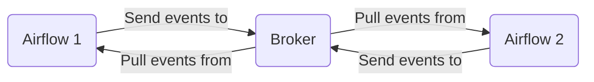
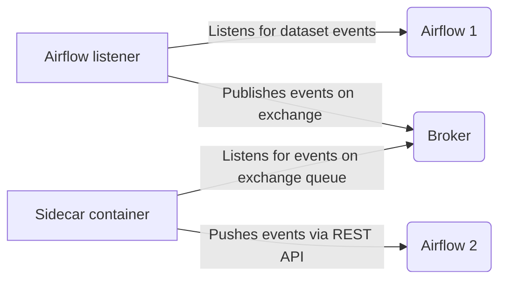

# Airbridge

## Description

Proof-of-concept implementation for forwarding (dataset) events between Airflow instances.

## Overview

Overall architecture:



Which is implemented as:



## Usage

We've created a local Docker-based stack for trying out Airbridge locally. This stack will spin up two Airflow instances together with a local message queue (RabbitMQ).

If you have [`go-task`](https://taskfile.dev/) installed, you can start the Docker stack using the following command:

```
task start
```

After the Docker commands have finished running, you should be able to reach the following two Airflow instances:

* A 'publisher' instance at http://localhost:8080.
* A 'consumer' instance at http://localhost:8081.

Open both Airflow's in your browser, logging in using credentials `airflow`/`airflow`. (You may have to open each instance in it's own browser or browser profile).

## Example

The Docker stack includes two example DAGs:

* An `example_publisher` DAG, owned by the `publisher` instance.
* An `example_consumer` DAG, which is part of the `consumer` instance.

The `example_publisher` DAG will update an example dataset called `my_favorite_dataset`, which should in trigger the `example_consumer` DAG in the `consumer` Airflow instance.

Try this out by triggering a manual run of the `example_publisher` DAG.
